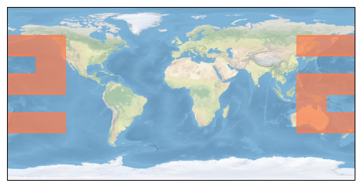

## Summary

Locations on and around planet Earth are commonly represented in a geodetic coordinate system with a longitude, a latitude, and a height.
Longitude is the "horizontal" dimension with a domain from -180° to 180°, which spans the entire 360° circumference of the planet. Where the two domain bounds meet is known as the _180th meridian_ or the _antimeridian_.

The GeoJSON specification [@10.17487/RFC7946] describes how antimeridian-crossing shapes should be split into multiple shapes at the 180th meridian.
Real-world geometries often do not comply with the specification, typically due to projected coordinates being naively reprojected to geodetic coordinates.
This leads to confusing and unrepresentable geometries.
Our **antimeridan** package provides Python functions for correcting improper geometries, as well as other related utilities.

## Statement of need

Because of factors such as the relative lack of populated settlements along the 180th meridian and the proliferation of British maps in the late 19th century, the Prime Meridian (0° longitude) runs through Greenwich, England [@alma992356353405961].
Before the advent of satellite imagery, relatively few geospatial products crossed the 180th meridian, and so the problem of antimeridian-crossing geometries was usually avoidable.
Now, satellite systems are producing data over the entire globe at an ever-increasing scale, meaning that more and more data exist that cross over the 180th meridian.
At the same time, the combination of these products with interactive online maps has made the antimeridian appear on almost anyone's tablet, web portal, or mapping app.
There is a a need to create and correct antimeridian-crossing geometries at scale, e.g. for large SpatioTemporal Asset Catalog (STAC) [@STAC_Contributors_SpatioTemporal_Asset_Catalog_2024] catalogs that are used to search and discover petabytes of geospatial data.
When creating these catalogs, improper antimeridian-crossing geometries need to be corrected before ingesting to a data store to ensure that queries do not break and visualizations do not incorrectly span the entire globe, often with chaotic representations.
This is the problem for which **antimeridian** was designed.

To the best of our knowledge, the [algorithm](https://antimeridian.readthedocs.io/en/stable/the-algorithm.html) underlying **antimeridian** is a novel one.
Briefly, it breaks each polygon into segments and finds where a segment might cross the antimeridian.
It splits that segment at the crossing point and closes each half of the segment along the antimeridian.
This results in a multi polygon split on the antimeridian, as the GeoJSON specification requires.

Our algorithm has some limitations.
While it can handle simple geometries that enclose the north or south pole, complex geometries can [cause failures](https://antimeridian.readthedocs.io/en/stable/failure-modes.html).
Another failure mode occurs when geometries contain segments that span more than half of the globe.

In addition to correcting GeoJSON geometries that cross the antimeridian, our library includes utilities for calculating the centroid of an antimeridian-crossing geometry and generating valid GeoJSON antimeridian-crossing bounding boxes.

## Key references

- The **antimeridian** package relies on Shapely [@Gillies_Shapely_2024] for geometry validation, conversions, and other operations.
- We use Cartopy [@Cartopy] to generate visualizations for our documentation.
- This library has been ported to Go by another developer at [go-geospatial/antimeridian](https://pkg.go.dev/github.com/go-geospatial/antimeridian).
- GDAL [@Rouault_GDAL_2024] can wrap shapes at the dateline ([`-wrapdateline`](https://gdal.org/en/latest/programs/ogr2ogr.html#cmdoption-ogr2ogr-wrapdateline)) and can produce similar outputs to **antimeridian** if tuned with the `-datelineoffset` flag.
  We created a [notebook](https://www.gadom.ski/antimeridian/v0.3.11/comparison/) to compare the two, and found the following:
  - In general, `antimeridian` and `ogr2ogr` perform the same, provided `ogr2ogr` is correctly tuned with the `-datelineoffset` flag.
  - `antimeridian` outputs the same geometry type as the input, whereas `ogr2ogr` outputs a `FeatureCollection`.
  - `antimeridian` has functionality to handle the poles.

## Acknowledgements

We acknowledge Rob Emanuele, Tom Augspurger, and Matt McFarland for the technical and financial support they provided us through the Planetary Computer program at Microsoft.
We also acknowledge our employers, Development Seed and Element 84, who support open source software through direct funding and developer contribution time.
