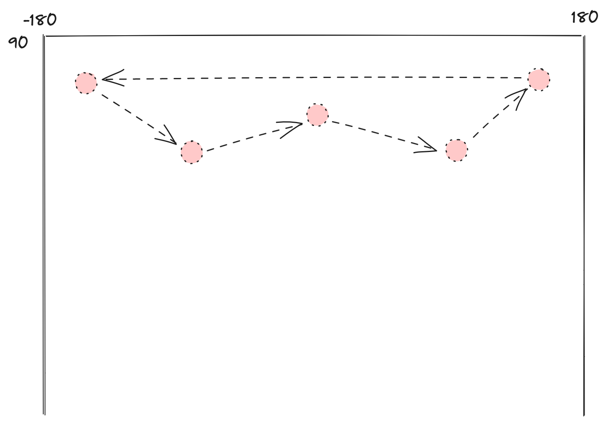
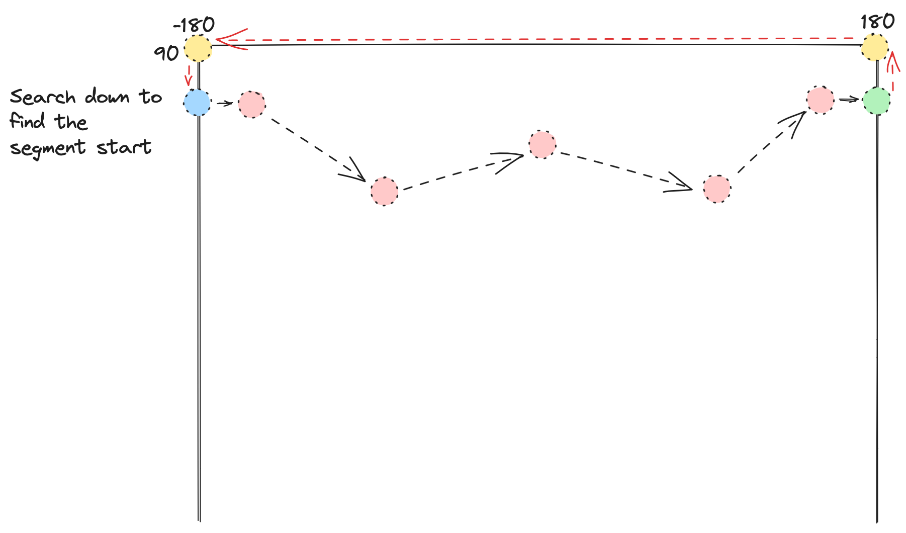

# The algorithm

What follows is a walkthrough, with visual aids, of the algorithm underlying this package.

## Background

Let's start with a simple GeoJSON geometry that doesn't come anywhere near the antimeridian.
For the sake of example, let's say it runs from 40° longitude west to 40° east, and from 20° latitude south to 20° north.
Its lower left point is at ``-40, -20``, and its upper right point is at ``40, 20``.


Now let's consider the same geometry, but shifted east 180 degrees.
Its lower-left point is ``140, -20``, and its upper-right point is at ``220, 20``.
Here's its representation in GeoJSON:

```json
--8<-- "docs/examples/crossing.json"
```

And visualized:


So far, good enough.
However, the bounds of [WGS84](https://epsg.io/4326), the coordinate system used by GeoJSON, go from -180° to 180° longitude.
This means that the upper-right coordinate of our antimeridian-crossing box should be "wrapped" to ``-140, 20``:

```json
--8<-- "docs/examples/wrapped.json"
```

Let's consider the four points of our "wrapped" box, and the order in which they're connected:

```text
    1              2              3            4            1

[140, -20] -> [-140, -20] -> [-140, 20] -> [140, 20] -> [140, 20]
```

Exterior rings in GeoJSON should be wound counter-clockwise, but you can see that our antimeridian-crossing box appears to be wound clockwise.


This leads to a confusing situation — because it's invalid GeoJSON!
You should not have a standalone clockwise ring.
When rendering this polygon, some systems automatically correct the winding order, and would display this shape centered on the prime meridian.
Another interpretation is that the shape is a hole, and the shell is the entire rest of the globe.
This is very rarely what you're actually trying to represent.


Our algorithm can take this invalid GeoJSON as input and produce valid GeoJSON as output.

## Segmentation

To correct the invalid GeoJSON, we break our polygon into **segments**.
To create segments, we start at the first point of the geometry, and walk through the points until we find a longitude jump of more than 180° degrees.


When we find such a jump, we split the polygon into segments by inserting two points, one on each antimeridian.
The first point ends the first segment, and the second point starts the second segment.


We then continue walking through the points, applying the same procedure when other jumps of 180° longitude are found.


We then finish walking the points.


Because the last point of a GeoJSON Polygon's coordinates is the same as the first point, we join the first and the last segments.


We now use our segments to build new polygons.
Let's consider the segment on the 180° antimeridian.
We take that segment's end point and search up the antimeridian for the first segment start point, joining those points to create a closed shape:


We use the same approach for the -180° antimeridian, but search down (towards the south pole) instead of up.

After the segments are joined, the individual Polygon are combined into a MultiPolygon.
This conforms to the [GeoJSON specification](https://datatracker.ietf.org/doc/html/rfc7946#section-3.1.9), which expects antimeridian-crossing polygons to be split into multipolygons at  the antimeridian.


## Complicated segmentation

Note that this segmentation approach works even in more complicated cases, e.g. if there's a "hole" (like a donut over the antimeridian):


## The poles

Geometries that overlap the north or the south pole present a related, but different, problem.
Here's a oval geometry that covers the north pole, as visualized from "above" the earth:


That geometry would be represented as a set of points, all with positive latitudes and with longitudes covering more-or-less the entire -180° to 180° extent of our coordinate system.
Because the edge of our geometry does not touch the pole, there's no point that has a 90° latitude.
This means that the geometry never touches the north pole in a cartesian visualization, since the maximum latitude of the geometry is less than 90°.



We use the same segmentation algorithm as described above, which in this case produces only a single segment.


When we try to close our polygon by searching "up" the 180° antimeridian from our end point, there's no start point to find.
So we create two new points, one on each antimeridian, and then continue the search down the other side.
Here's that drawn out, step-by-step.

First, we search up the antimeridian and find no points.


We add two points, one at the top of each antimeridian, and add them to the segment.


Finally, we search down the 180° antimeridian until we find our segment start point.



This produces a single valid GeoJSON polygon that encloses the pole in a cartesian visualization.


