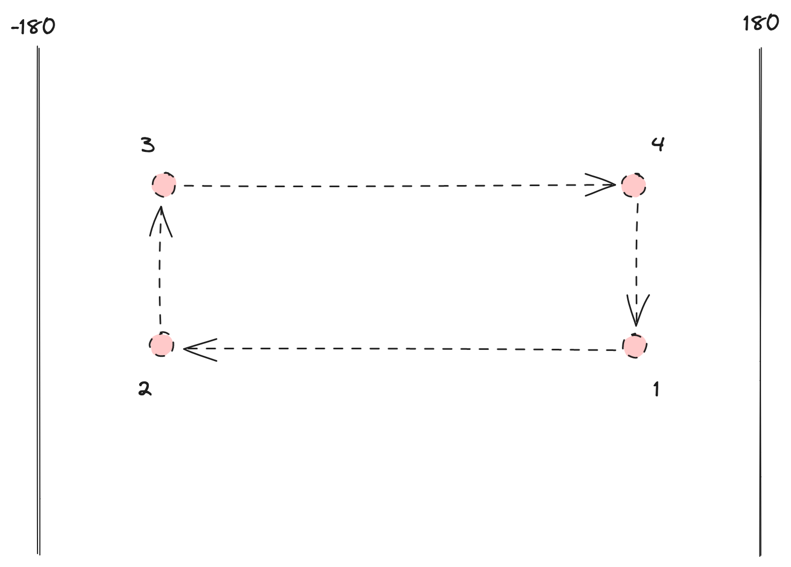
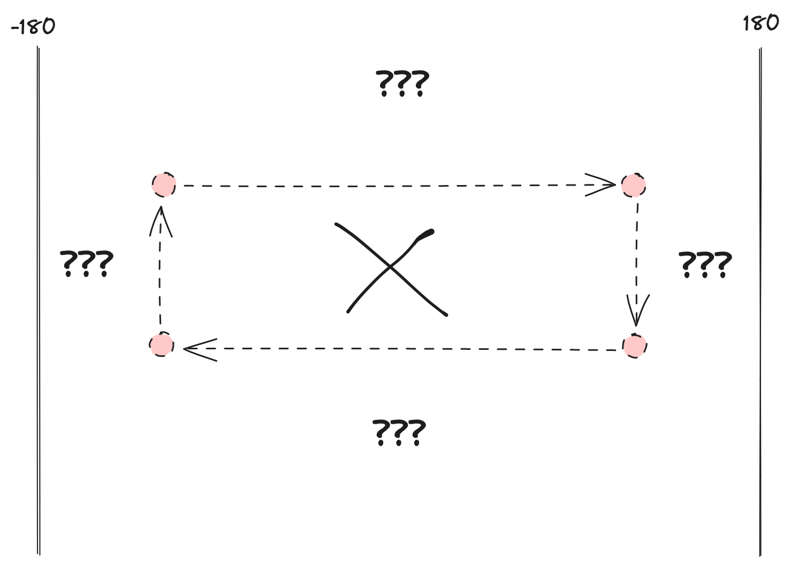
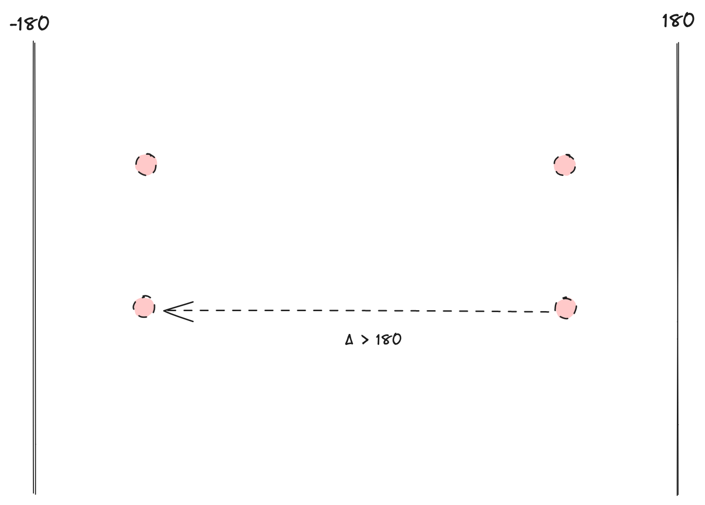
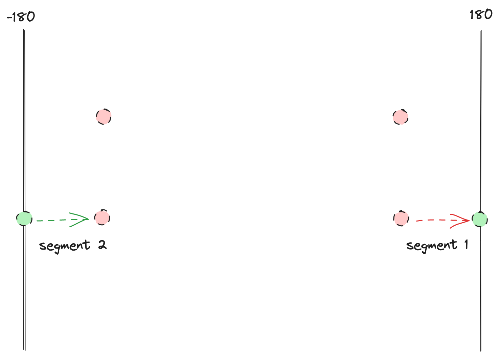
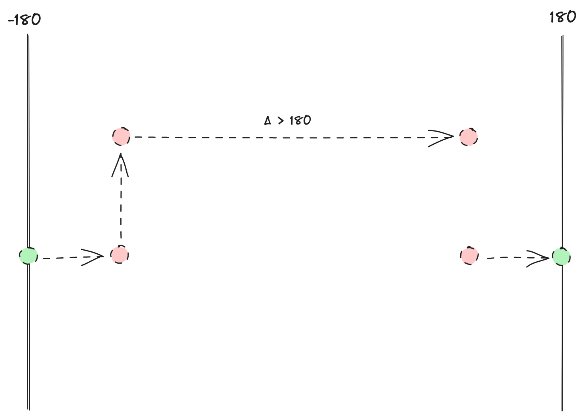
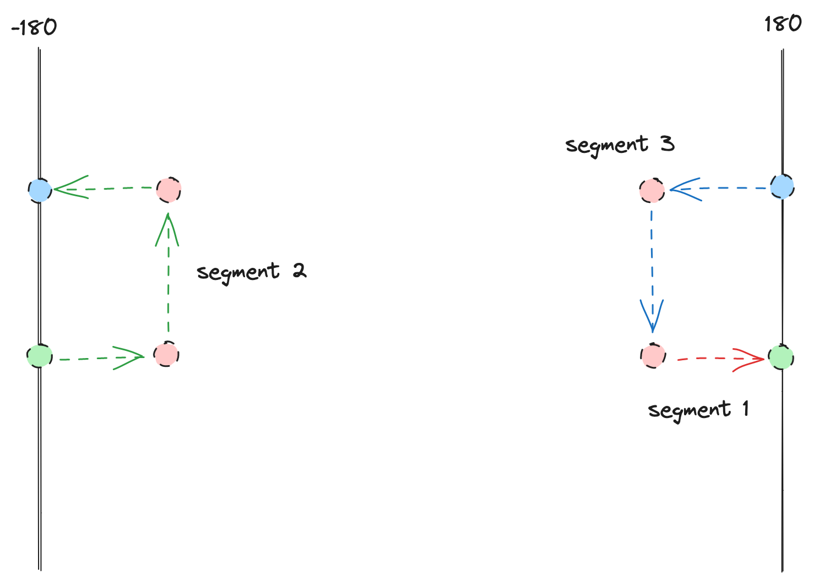
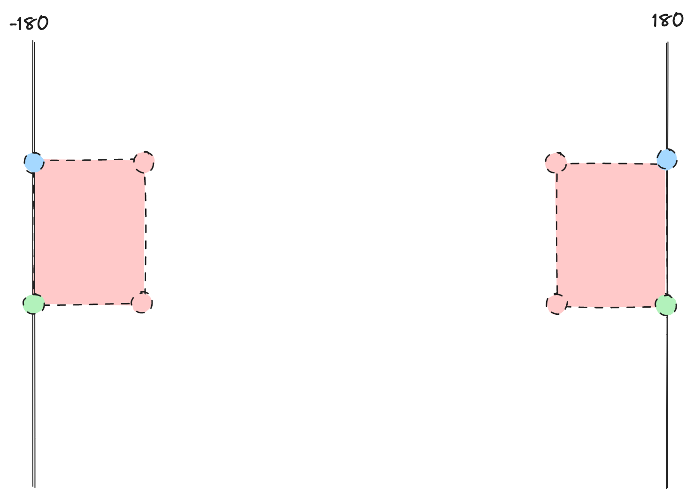
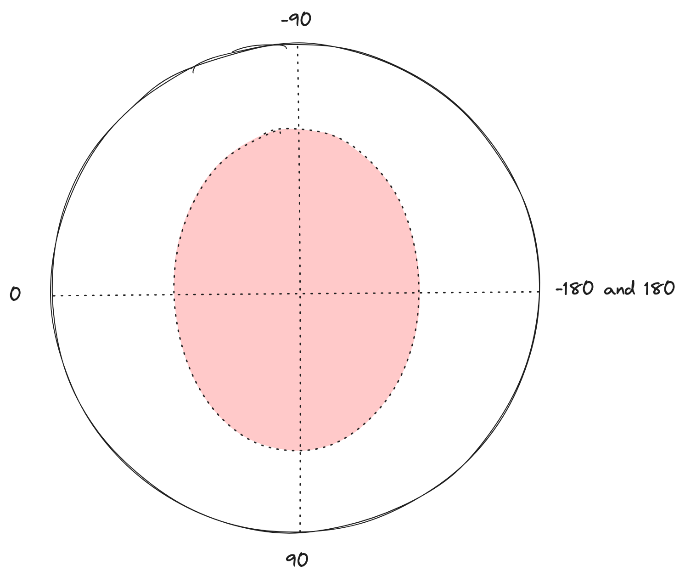

The algorithm
=============

What follows is a walkthrough, with visual aids, of the algorithm underlying this package.

Background
~~~~~~~~~~

Let's start with a simple GeoJSON geometry that doesn't come anywhere near the antimeridian.
For the sake of example, let's say it runs from 40° longitude west to 40° east, and from 20° latitude south to 20° north.
It's lower left point is at ``-40, -20``, and its upper right point is at ``40, 20``.

.. figure:: img/box.png
    :scale: 30%
    :align: center

    A simple box.

Now let's consider the same geometry, but shifted east (or west) 180 degrees.
Its lower-left point is ``140, -20``, and its upper-right point is at ``220, 20``.

.. figure:: img/crossing.png
    :scale: 30%
    :align: center

    A box that crosses the antimeridian.

So far, good enough.
However, the bounds of WGS84, the coordinate system used by GeoJSON, go from -180° to 180° longitude.
This means that the upper-right coordinate of our antimeridian-crossing box are often "wrapped" to ``-140, 20``.
This leads to this confusing visual representation.

    A box that crosses the antimeridian, wrapped.

Let's consider the four points of our box, and the order in which they're connected.
Exterior rings in GeoJSON should be wound counter-clockwise, but you can see that our antimeridian-crossing box appears to be wound clockwise.

    The four points in our box, with their connections.

This leads to a confusion situation, where the "correct" interpretation of our antimeridian-crossing box would be globe-covering shape with a "hole" over the equator and the prime meridian.
This is very rarely what you're actually trying to represent.

    If we interpret our antimeridian-crossing box literally, it describes a very strange geometry.

Here's where our algorithm comes in.

Segmentation
~~~~~~~~~~~~

Given our antimeridian-crossing box as our input, we walk through the points until we find a longitude jump of more than 180° degrees.

    A longitude jump greater than 180°.

When we find such a jump, we split the polygon into segments by inserting two points, one on each antimeridian.

    Creating two segments by adding points on the antimeridian.

We then continue walking through the points, applying the same procedure when other jumps of 180° longitude are found.

    Another jump of more than 180° longitude.

When we finish walking the points, we join the last segment back to the first.

    Finishing the segmentation step.

Finally, segment end are joined to segment starts by searching up or down the antimeridian to create multiple polygons.
This conforms to the `GeoJSON specification <https://datatracker.ietf.org/doc/html/rfc7946#section-3.1.9>`_, which expects antimeridian-crossing polygons to be split into multipolygons at  the antimeridian.

    The output polygons.

The poles
~~~~~~~~~

Geometries that overlap the north or the south pole present a related, but different, problem.
Here's a oval geometry that covers the north pole, as visualized from "above" the earth:

    A polygon encircling the north pole.

That geometry would be represented as a set of points, all with positive latitudes and with longitudes covering more-or-less the entire -180° to 180° extent of our coordinate system.
Because the edge of our geometry does not touch the pole, there's no point that has a 90° latitude.
This means that a classic cartesian visualization of the geometry never touches the north pole, since the maximum latitude of the geometry is less than 90°.

.. figure:: img/pole-as-points.png
    :scale: 30%
    :align: center

    The same polygon as points, visualized in a cartesian plot.

Our algorithm includes a step after segmentation that "extends" segments over the pole, when appropriate, by adding two new points.
This produces a valid GeoJSON geometry that encloses the pole.

.. figure:: img/pole-enclosed.png
    :scale: 30%
    :align: center

    After segmentation, our algorithm adds points to enclose the pole.
